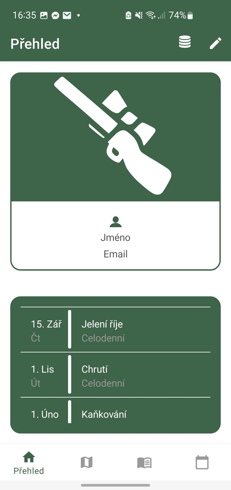
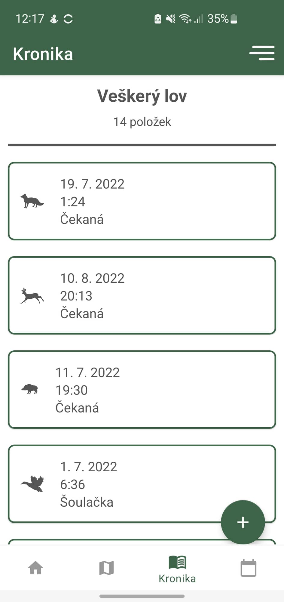
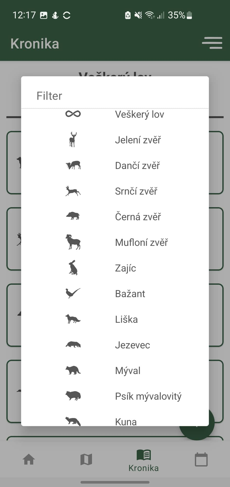
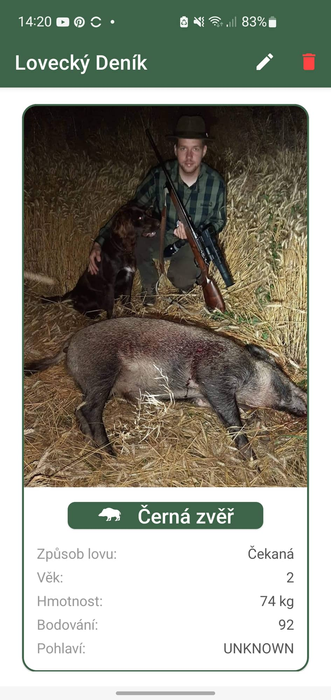
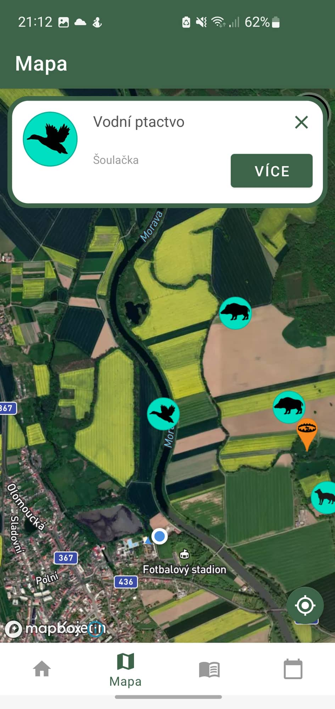
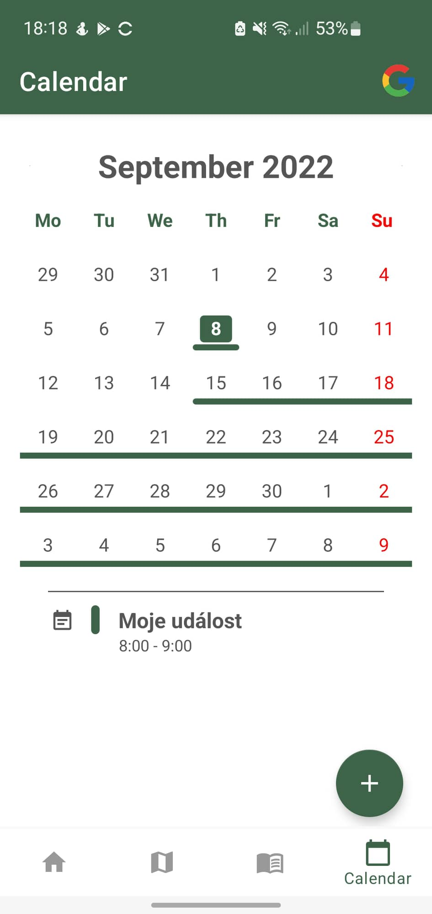

# Hunting Diary
Hunting diary is mobile application for helping hunters with their job. This repo is copy of project folder for IDE Android Studio. Unfortunately, app is not available yet on Google Play, But you can download "Hunting Diary.apk" file to your mobile phone and you can start using the app. The app is available in Czech and English.

## Description
This application is a result of my bachelor thesis. App's main function is to store records of hunted game and show these records on the map because of   location. App allows user to create and keep some important hunting events in app's hunting calendar. Calendar can be synchronized with user's google  account.

## Features
 - Export data into to CSV file including photos
 - Import data and photos from CSV file into the database
 - Switch between light and dark themes based on phone setting
 - Switch between languages based on phone setting (Czech and English is available)
 - View location of hunt on the map (provided by Mapbox)
 - Create, edit, delete informations and photo about record of hunted game
 - Get notification about hunting events from calendar
 - Completely ad-free

## Permissions needed
- Read/write to external storage of device
- Full internet access
- Full network access
- Read/write into the calendar
- Wifi access
- Location access

## SDK verison
- minSdk: 27
- targetSdk: 31

## Screenshots

    
    
    
   

 

 
    
    

## Project structure
- manifest/AndroidManifest
    - Application setting file (set icons, default activities, permissions etc.)
- java/tma.inf.upol.loveckydenik
    - activities
        - All activities are defined here
        - Activity describes a new screen in application
    - adapters
        - All adapters are defined here
        - Adapter is a component for list of items implementation
    - calendardecorators
        - Here are classess used to for calendar visualization
    - database
        - All files for database manipulation are here
        - **ViewModel** architecture is used here:
            - Dao 
                - SQL queries
            - Repository
                - Working with Dao object
                - Layers separation
            - ViewModel
                - Working with repository object
                - Kotlin Corountines are implemented here
                - This is a final object for manipulating with database
    - dialigs
        - All edited classes for user dialogs display
    - enums
        - All enum classes defined here 
    - fragments
        - All fragment classes are defined here
        - Fragment represents a reusable content for activity -> fast and easy content change
    - singletons
        - All singletons defined here
    - spans
        - All classes for text visualization are defined here
    - res
        - Here are all static resources like layouts, images, icons, static values and etc.
    - Gradle scripts
        - All build files are defined here
        - Here is a libraries and dependencies import
        - Also **SDK** version is specified here

## Technologies used
- `Kotlin` programming language + `Kotlin Coroutines`
- `XML` for UI description
- `Android Studio` as IDE
- `SQLite` database for storing data
- `Gradle` building tool

## Dependencies
- `Google Material Design` for textbox, buttons and list of items visualization
- `Navigation menu` for simple navigation trough an application
- `RecyclerView` for effective and fast list items display 
- `Room Database` for effective and easy manipulation with SQLite databse
- `Lifecycle components` for connecting data with lifecycle of application or activity or fragment -> helpful for data display
- `CalendarView` for calendar implementation
- `Kotlin Coroutines` for run a code in the background
- `Splashscreen` for display "user friedly" splashscreen after the start of application
- `EasyPermission` for easy acquisition of user permissions (like location permission)
- `Mapbox Maps SDK` and `Mapbox Annotation` for implementation map in an application
- `Yoyo animation` for simple animation implementation
- `Kotlin CSV reader and writer` for CSV files manipulation 